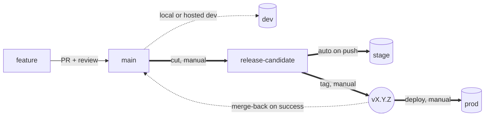

# ADR 0024: Branching, releases, and environments

## Context and Problem Statement

Setting up standards for forks/children. Following [GitLab Flow with release branches](https://docs.gitlab.com/ee/topics/gitlab_flow.html#release-branches-with-gitlab-flow)
and [SemVer](https://semver.org/). [ADR 0025](0025-production-data-flow.md) covers the data direction (production → lower envs).

## Decision Outcome

### Environments

| Env   | Source of truth       | Trigger                                               | Required?     |
| ----- | --------------------- | ----------------------------------------------------- | ------------- |
| dev   | `main` (or feature) | local; or auto on merge if hosted                     | optional      |
| stage | `release-candidate` | auto on push                                          | **yes** |
| temp  | any branch            | manual workflow                                       | optional      |
| prod  | `vX.Y.Z` tag        | manual; tag must originate from `release-candidate` | **yes** |

**Direction of travel for dev**: target shape is hosted dev as a
**1% cutdown of stage**. Services graduate when that pipeline
exists; none are required to today.

### Branches

- **`main`** — trunk. Protected. Every change via PR.
- **`release-candidate`** — release-candidate branch. Protected.
  Updated by deliberately merging `main` (not auto-followed).
  Auto-deploys to stage.

Named `release-candidate`, not `stage`, to disambiguate from the
env. *"`release-candidate` HEAD ≠ last tag"* = release in flight;
*"stage is broken"* = the running env. Two concepts, two names.

Feature branch shape: `<type>/<ticket>-<short-description>`
(Conventional Commits — [ADR 0020](0020-github-repo-conventions.md)).

### Standard release flow

Bold = deploy paths; dotted = ref movement. Every transition
between `main`, `release-candidate`, and a tag is a manual
workflow dispatch.

1. **Feature → main.** PR + review + merge. Auto-deploys to hosted
   dev if the service has one.
2. **Cut.** Workflow (example `cut-release.yml`) merges `main` →
   `release-candidate`. Auto-deploys to stage.
3. **QA on stage.** Fixes land directly on `release-candidate` or
   via small PRs. Scope is `git log <last-tag>..release-candidate`.
4. **Tag.** Workflow (`tag-release.yml`) bumps version, commits on
   `release-candidate`, pushes `vX.Y.Z`. Bump type auto-detected
   from conventional commits ([ADR 0020](0020-github-repo-conventions.md)).
5. **Deploy prod.** Workflow (`deploy-prod.yml`) takes the tag,
   builds at tag SHA, rolls out. **On full success, merges the tag
   commit back to `main`.** A failed deploy leaves `main`
   untouched.

**Release-in-flight is enforced by mechanism**, not policy. The
cut workflow refuses to run when `release-candidate` HEAD ≠ last
`v*` tag; a shared concurrency group across cut/tag/deploy
prevents interleaving.

### Hotfix flow

Same shape, candidate originates from the tag:

1. Branch `hotfix/<ticket>-<desc>` from the latest production tag.
2. Apply the fix.
3. **PR targeting `release-candidate`.** The PR is the gate —
   any in-flight release work surfaces as a conflict, reviewable,
   not silently destroyed.
4. Merge, QA on stage, sign off.
5. Tag (auto-detects PATCH for `fix:`), deploy, merge-back —
   identical to standard flow from step 4 onward.

Tag on `release-candidate` (not `main`): `release-candidate`
carries only the fix on top of the tag; `main` may contain
unreleased work the hotfix shouldn't drag along.

### Temp environment

Per-service escape hatch for work that can't sit on `main` yet —
long-running integrations, live-env testing before stage-readiness.

- **One temp per service.** "Service" = anything that deploys
  (under `apps/`, under `repos/`, or the whole repo). Concurrent
  feature branches must serialise.
- **Off by default.** Created on demand; torn down when work
  passes. Idle temp = bug.
- **Any branch, no PR gate, social governance.** The deploying
  engineer announces; the team coordinates. Adding a gate makes
  it nearly as heavy as the stage flow.
- **Stage-equivalent backing services.** Never production
  credentials, never production data.
- **Not a release gate.** Work validated on temp still travels
  the full release path.

Preferred direction is trunk + feature flags; temp is the
escape hatch when that's not yet practical.

### Protection requirements

Mandated *what*; setup *how* is per-fork.

- **`main` and `release-candidate`**: PR required, ≥1 approval,
  CODEOWNERS review ([ADR 0020](0020-github-repo-conventions.md)),
  required status checks ([ADR 0021](0021-github-actions-ci.md)),
  no force-push, no deletion.
- **Bot/automation actor with bypass on both branches** —
  without it, merge-back fails and every release ends in a
  manual PR. Long-term: GitHub App, not a long-lived PAT.
- **Tag protection on `v*`**: creation/deletion restricted to
  the bot. Whoever can push `v*` can ship prod.
- **GitHub Actions Environment `production`** with ≥1 human
  approver before prod jobs run. Defence in depth on top of
  manual dispatch.
- **Production secrets** scoped to the `production` environment
  only.
- **Merge strategy: allow merge commits.** Squash-only would
  break the `--no-ff` merge-back.

### Deliberately not adopted

- **Required signed commits** — adds friction, bot pushes
  unsigned anyway. Revisit after GitHub App migration.
- **Linear history on `main`** — incompatible with the `--no-ff`
  merge-back.

## Consequences

### Positive

- Three envs map cleanly to three sources of truth: `main`,
  `release-candidate`, tags.
- Production deploys are atomic with merge-back — a failed
  rollout doesn't poison `main`.
- Hotfixes ship without dragging unreleased `main` work along.
- Release scope is auditable from `git log`.
- "One release in flight" is mechanism, not policy.

### Negative

- **`main → release-candidate` bypasses PR review.** Deliberate
  (QA gate is the stage env), but `main` will carry auto-merges
  with no reviewer attached.
- **Auto-merge conflicts block flow** — either auto-merge (cut
  or merge-back) hitting a conflict requires manual resolution.
- **Long-lived PAT** until GitHub App migration; for the bot,
  branch protection is best-effort.
- **Auto-bump depends on commit hygiene.** A feature merged as
  `chore:` produces a patch bump.

### Neutral

- Long QA windows on `release-candidate` accumulate `main` diff.
  Fast cadence preferred.
- Temp env is opt-in; services without one pay nothing.

## Alternatives considered

1. **Single-branch trunk, tag from `main`.** Simpler, but
   feature-flag discipline becomes load-bearing. A fork with
   strong flag discipline can adopt this variant. Rejected as
   default.
2. **Auto-followed `release-candidate`.** Defeats the deliberate
   slow-down; makes the branch a useless copy of `main`.
   Rejected.
3. **`stage` as branch name (no rename).** Conflates branch and
   env; "stage is broken" becomes ambiguous. Rejected.
4. **Mandatory hosted dev for every service.** Forces
   infrastructure on services that don't have it. Rejected as
   mandate; kept as direction-of-travel.

## Related

- **[ADR 0020](0020-github-repo-conventions.md)** — Conventional Commits that drive auto-bump + CODEOWNERS review.
- **[ADR 0021](0021-github-actions-ci.md)** — workflow shape this builds on.
- **[ADR 0025](0025-production-data-flow.md)** — companion (production data flow).
- **[ADR 0030](0030-child-apps-and-repos.md)** — recommended (not enforced) for children.
- [GitLab Flow — release branches](https://docs.gitlab.com/ee/topics/gitlab_flow.html#release-branches-with-gitlab-flow)
- [Semantic Versioning](https://semver.org/)
