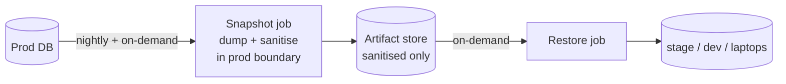

# ADR 0029: Production data flow to lower environments

- **Status**: Proposed
- **Date**: 2026-05-22
- **Tags**: data, security, environments, sanitisation

## Context

[ADR 0028](0028-branching-releases-environments.md) covers code
direction (feature → main → tag → prod). This ADR covers the
opposite: production data flowing into lower environments for
realistic development and integration testing.

Without a convention, every service hand-rolls a prod dump
shared via laptop or shared filesystem — exposing PII,
credentials stored as data (payment provider keys, OAuth
tokens), and pending outbox events that replay against live
external endpoints on restore.

## Decision

Production data flows to lower environments only via a
**sanitised snapshot**. Three hard rules, decoupled pipeline.

### Hard rules

- **Raw production data never leaves its environment.** No raw
  dump on shared storage, on a developer laptop, or in CI logs.
- **Sanitisation happens inside the prod boundary** — same VPC,
  same cloud account, same trust boundary. The artifact that
  leaves is already sanitised.
- **Production credentials never reach CI runners or developer
  machines.** The scheduler triggers via IAM/role assumption,
  not by handing prod credentials to a GitHub Actions runner.

### Pipeline shape

Two **decoupled** jobs. Stage refresh reads the latest
sanitised artifact — it doesn't re-dump prod. Repeated restores
are cheap; prod DB load is bounded.

### Sanitisation principles

- **SQL-level (or equivalent at-rest), not stream parsing.**
  Streaming `pg_dump` output is fragile — `COPY` column ordering
  isn't guaranteed, JSON columns corrupt easily, schema changes
  break the parser silently. SQL `UPDATE` / `TRUNCATE` against a
  restored copy is correct by construction.
- **Sanitise three categories by default**: PII redacted;
  credential columns overwritten with sentinels; outbox / event
  tables truncated.
- **Script is version-controlled** (e.g.
  `scripts/sanitise-db.sql`), reviewed in PRs like any code.
- **Idempotent and standalone-runnable** — re-running against
  an already-sanitised DB is a no-op; manual ad-hoc use works.

### Where the sanitised data lands

- **stage**: full sanitised snapshot. Refresh cadence per-service.
- **hosted dev** (when present, per [ADR 0028](0028-branching-releases-environments.md)):
  a **1% cutdown of stage** — same shape, smaller volume.
- **developer laptops**: pull the artifact directly, IAM-gated.
- **temp env** ([ADR 0028](0028-branching-releases-environments.md)):
  stage-equivalent backing services → same sanitised data.

### Out of scope for this ADR

Per-fork choices: specific cloud / orchestrator (AWS Batch, ECS,
Cloud Run, Lambda for small DBs), artifact store (S3, GCS),
schedule (nightly is the default; weekly acceptable for slow
services), and per-service sanitisation tables / columns.

## Consequences

### Positive

- PII and credentials never reach developer machines or CI runners.
- Schema-resilient sanitisation survives column reorderings and
  most additions.
- Decoupled snapshot/restore bounds prod load — stage refresh
  costs an artifact read, not a fresh dump.
- Realistic dev data — bugs that only appear with prod-shape
  data become reproducible locally.

### Negative

- **Sanitisation script is a maintenance surface.** New PII or
  credential columns leak on the next snapshot if not added.
  Schema-change PR review is the mitigation.
- **First-snapshot work is real** — scheduler, container, IAM,
  script setup per service.
- **No automated "did we miss a column" detection.** Out of
  scope; a future tooling concern.

### Neutral

- Cadence is per-service. Forks without production data skip
  this entirely.

## Alternatives considered

1. **Ad-hoc dumps shared via internal storage.** Today's
   default; the failure mode this ADR addresses. Raw data on
   shared filesystems, no audit trail. Rejected.
2. **Stream-parse `pg_dump` for sanitisation.** Faster but
   fragile (column ordering, JSON, schema changes silently
   break). SQL against a restored copy is correct by
   construction. Rejected.
3. **CI runner pulls and sanitises.** Hands prod credentials
   outside the prod trust boundary. Rejected on rule 3.
4. **Lambda / short-lived function only.** 15-min hard timeout
   doesn't scale to large DBs. Acceptable per-service for small
   DBs within the constraints; not a default.
5. **Manual on-demand only, no schedule.** Saves automation
   cost; lower envs drift further from prod shape over time and
   the "let me just pull prod quickly" temptation grows.
   Rejected as a default.

## Relationship to prior ADRs

- **Companion to [ADR 0028](0028-branching-releases-environments.md)**
  — code direction; data direction.
- **Builds on [ADR 0015](0015-trivy-security-scan.md)** at the
  principle level: prod-data containment is security-adjacent.
- **Consumed by [ADR 0027](0027-runbook-and-sop-format.md)** —
  per-service sanitisation and restore may carry their own
  runbooks.

## References

- [ADR 0028](0028-branching-releases-environments.md) — code direction.
- [ADR 0015](0015-trivy-security-scan.md) — security gate.
