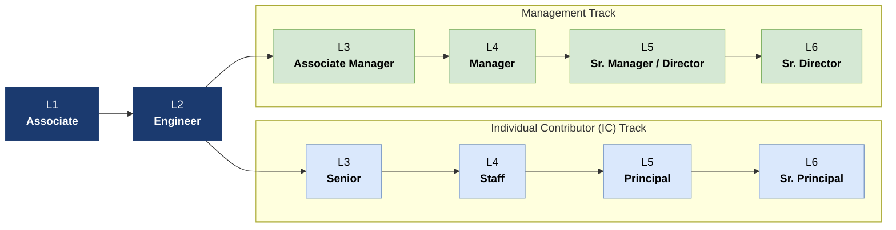

# Career

This ladder is written for an era where AI can do the typing. What it measures is what AI can't: **judgement, scope, taste, and *scar tissue*** — the pattern recognition that only comes from making mistakes and learning from them.

An engineer is no longer the person you hand a spec and get working code from — an AI does that. An engineer is the person who knows when the spec is wrong, when the AI's output is plausible-but-broken, and when to stop and re-plan.

---

A guide for shaping career-progression conversations between you and your manager. **It is a guide, not a checklist.** It doesn't indicate or guarantee promotion — promotion follows sustained strong performance at your current level *and* readiness to succeed at the next.

> Living document. If a level or facet description doesn't match how the work actually feels, push back. We'd rather update the guide than rate against a stale one.

> Adapt this to your team size. Many small teams only need L1–L4, or even L1–L3. Don't invent ceremony you don't need.

## Why levels exist

Hiring is half the equation. The other half is growing the team you have — and that needs a path people can see.

We believe attributes and abilities are not fixed; they can be learned. The level guide exists so that growth conversations are about *what* progresses, not *whether* progression is possible.

**Terminal positions start at L3.** Once you're at L3 (fully independent except where tribal knowledge is needed), there is no expectation to keep climbing. You can perform at L3 indefinitely.

## Facets

Growth is evaluated across **five facets**. Mastery at a level is measured across *all five* — not just the one you happen to be strongest in.

- **Organisational Leadership** — how you develop talent. Mentoring, interviewing, keeping the bar high. The *hollowed-out middle* is the failure mode an AI-amplified team faces; this facet is how we prevent it.
- **Technical Leadership** — pair-planning competence, review craft, design scope. How you work with teammates and AI.
- **Impact and Influence** — customer value, scope of delivery, how broadly you operate beyond your home discipline. *Full-team* thinking.
- **Delivery and Ambiguity** — which product risks you own (feasibility, usability, value, viability), at what scope, and how well you operate where the risks aren't yet known.
- **Operations** — operational excellence. Monitoring, incident response, ongoing health of what you ship.

Some roles need additional facets (design, security, infra). Add them per role — don't force every track through the same matrix.

## Levels at a glance

**Role titles** (Engineering — adapt for other disciplines):

| Track                 | L1                 | L2       | L3                            | L4                  | L5                      | L6                          |
| --------------------- | ------------------ | -------- | ----------------------------- | ------------------- | ----------------------- | --------------------------- |
| Engineering (IC)      | Associate Engineer | Engineer | Sr. Engineer                  | Staff Engineer      | Principal Engineer      | Sr. Principal Engineer      |
| Engineering (Manager) | Associate Engineer | Engineer | Associate Engineering Manager | Engineering Manager | Sr. Engineering Manager | Sr. Director of Engineering |

**In one word:** **L1** Learning · **L2** Doing · **L3** Mastering · **L4** Driving · **L5** Amplifying · **L6** Predicting.

From **L3 onwards**, the IC and management tracks diverge. Both are valid; both reach the same compensation band; neither is "above" the other.

Scope of impact grows with each level — from yourself, to your team, to teams around you, to the entire organisation.

## How juniors grow when AI does the typing

The simple-code-craft progression — *"writes code with oversight"* → *"writes code that needs less modification"* → *"writes code held up as example"* — is all but gone. AI does that work.

If we're not deliberate, juniors never get the **scar tissue** that makes mid-level engineers valuable. They become permanent prompt-typists, never developing the judgement they need. The industry calls this the **hollowed-out middle**: seniors at the top, AI doing the work, nothing growing into senior in between.

Part of our answer is **[Pair Planning](development.md#pair-planning-and-pair-review)** — the apprenticeship model. L1 and L2 engineers grow by:

- **Being the second human checkpoint** on senior engineers' AI-assisted plans. The pair planner puts their name to the ticket, so the review has to be substantive.
- **Reading high volumes of AI output critically.** Spotting the plausible-but-wrong, the architecturally-off, the hallucinated API. Building taste before they ever touch the keyboard.
- **Owning small but real production systems.** Incident retrospectives are high-scar-tissue work. Give juniors real responsibility, not toy tasks.
- **Being asked "why?" until the why is understood.** The why determines what done looks like. AI can't ask itself why.

This shifts the L1 hiring profile. We hire for critical thinking and judgement, not for *"can you implement fizzbuzz"*. (We never liked leet code anyway.) Show us you can spot a hallucination, not that you can write a binary tree from memory.

## The matrix

### Organisational Leadership

> The hollowed-out middle is the biggest risk in an AI-amplified org: seniors at the top, AI handling the work, no path from junior to senior. Organisational Leadership is the facet that prevents this. **The duty to develop the level below you doesn't get easier when AI does the typing — it gets harder.** The easy mentorship work (reviewing a junior's simple code change) doesn't exist anymore. You have to mentor on plan review, on taste, on scar tissue.

- **L1** — Onboards alongside engineering interns and new hires. Helps update onboarding docs. Reviews peers' AI-assisted plans constructively.
- **L2** — Actively mentors engineers at L2 and below (mostly informal — teaching, training, helping). Pairs with juniors on plan review as the second human checkpoint. Interviews at level for fundamentals and tech.
- **L3** — Actively mentors engineers at L3 and below (formal and informal). **Owns the apprenticeship for L1 / L2 engineers in their area** — explicitly coaches them on pair planning, taste, and developing scar tissue. Trusted interviewer.
- **L4** — Actively mentors and develops engineers at L4 and below. Resists "the junior pipeline is solved by AI" thinking. Models taste in plan and code reviews. Role model for technical interviews.
- **L5** — Mentors and develops engineers at L5 and below. Sets the team's apprenticeship norms — what L1 / L2 work looks like, what the on-ramp from L2 → L3 requires. Drives improvement and bar-levelling in the interview process.
- **L6** — Mentors and develops engineers at L6 and below, across functions. Shapes the org's posture on junior hiring and apprenticeship. Trusted interviewer for many roles across the org.

### Technical Leadership

> Progression here moves from *verifying AI output*, to *directing AI toward harder problems*, to *setting norms others follow*, to *shaping the organisation's relationship with AI capability*. [Pair Planning](development.md) is the practice that runs through every level.

- **L1** — Reads AI-generated code and plans critically; identifies plausible-but-wrong output (logic errors, hallucinated APIs, missing edge cases) before committing. Participates as the second human checkpoint on simple changes. Asks *"does this output actually do what the prompt asked?"* as a habit. **Doesn't ship code they can't explain.** Learning the dev / ops / test tools. Follows release processes diligently.
- **L2** — Originates pair-planning sessions for well-defined work; expects plans to be critiqued. Reviews peers' plans with substantive feedback, not rubber-stamping. Identifies scope creep during AI-assisted work and pushes back. Reviews AI-assisted PRs with the same rigour as hand-written code; transfers knowledge in review comments. Owns designs for moderately complex feature- or service-level work.
- **L3** — Originates plans for complex feature work; defends them in pair review. Exercises **taste** — rejects technically correct but architecturally wrong AI solutions and articulates why. Identifies classes of problems where AI output degrades (sparse context, ambiguous specs, novel integrations) and adjusts approach unprompted. **Pairs with L1 / L2 as the second-human checkpoint** — transfers judgement-building, not just code-review feedback. Owns designs for whole service or product-feature areas. Reviewer for system and feature designs.
- **L4** — Drives long-term designs across multiple services or product areas — often hands-on during implementation. Keeps system designs **AI-amenable**: surfaces when architectural choices are making AI-assisted work harder, proposes remediation. Sets team-level standards for when pair planning is mandatory vs. optional. Reviewer of designs across an engineering group.
- **L5** — Defines team-level norms for AI-assisted development: when to use agents vs. manual, how to structure context for the codebase, what review standards apply to AI-heavy PRs. Identifies systemic failure modes (convention drift, test-coverage gaps, documentation lag) and drives tooling or process to address them. Coaches L1–L3 on developing taste — recognising quality independent of who or what produced it. Drives the North-Star architecture and long-term designs across a platform or product line.
- **L6** — Sets organisational posture on AI amplification: defines what work must remain human-owned and why; holds the line when product pressure pushes toward unchecked automation. Identifies compounding risks at scale (knowledge erosion, over-reliance on model correctness, security surface expansion) and drives mitigation. Evaluates AI tooling at organisational level — not just *"does it speed up coding?"* but *"does it improve our ability to reason about what we're building?"* Drives harmonisation of the North-Star architecture across multiple platform areas or product lines.

### Impact and Influence

> AI lets one engineer orchestrate the work that used to need a multidisciplinary team — what we call **full-team** thinking. As you progress, your range expands beyond engineering: PMs become strategy sparring partners, design becomes a taste council, specialists in adjacent functions become advisors rather than gates.

- **L1** — Learning to build effective working relationships within a team. Understands business needs; delivers value through code. Impact at the feature level within a product or service.
- **L2** — Effective working relationships within the team, including cross-functionally (PM, UX, support). Begins to operate beyond discipline boundaries — uses AI to spin up UX prototypes for designer review, contributes to product discovery rather than waiting for finished specs. Impact at the feature or service level within a single team.
- **L3** — Effective working relationships across multiple teams and functions. **Operates as a full-team contributor** — the person you hand a problem to, not a spec. Owns product surfaces that span engineering *and* adjacent disciplines (light user research, UX validation, business-case framing). Resolves dependency challenges across the engineering group. Owns the lifecycle of a service or product-feature area.
- **L4** — Influential working relationships across multiple teams and functions. PMs become **strategy sparring partners** rather than spec providers; design becomes a **taste council** rather than a gatekeeper. Influences roadmap; creates cross-group commitments. Delivers results across multiple feature or service areas. Owns design, architecture, and lifecycle planning across them.
- **L5** — Effective relationships across multiple engineering groups and multiple functions. Delivers results for a product line or platform area. Resolves issues across engineering and adjacent disciplines regardless of ownership. Specialists in adjacent functions (design, security, infra) work with you as advisors, not as gates. Owns long-term architecture and lifecycle planning for a core platform area or product line.
- **L6** — Effective working relationships across the whole company, including with directors outside engineering. A recognised engineering leader. Delivers across multiple product lines or platform areas. Represents the company externally. Harmonises architecture across platform areas and product lines. Influences business direction.

### Delivery and Ambiguity

> Building anything has four risks (per Marty Cagan):
>
> - **Feasibility** — can we build it?
> - **Usability** — can users use it?
> - **Value** — will users want it?
> - **Business Viability** — does it make business sense?
>
> **AI compresses Feasibility risk dramatically** — prototypes in hours, not weeks. That lets engineers at every level own more of the other risks earlier than they used to. Progression in this facet is owning more of the four risks at greater scope, and operating where the risks aren't yet known.

- **L1** — Owns **Feasibility-risk validation** on well-defined sub-problems. Uses AI to prototype quickly when stuck. Problems are well-scoped; technical requirements are defined. Delivers sprint-level work on time, with quality.
- **L2** — Owns **Feasibility** for a feature; begins to engage with **Usability** (spins up UX variants for designer or PM review). Delivers large tasks (up to a quarter) on time. Can serve as a project or feature-execution lead. Problems are well-defined but complex. Business requirements are given; engineer prioritises and triages technical requirements independently.
- **L3** — Owns **Feasibility + Usability** for a service- or feature-area. Drives clarity on ambiguous technical requirements. Identifies stack-level problems and drives solution definition. Engages with internal and external stakeholders; harmonises discordant views. Delivers single-quarter projects on time. Expert in their area.
- **L4** — Owns **Feasibility + Usability** across multiple feature areas; engages with **Value risk** when needed (prototypes with users to validate before committing engineering investment). Delivers multi-quarter projects on time. Works cross-functionally to derive goals from business objectives; evolves requirements into technical designs. Problems are extremely complex; technical solutions aren't known up-front.
- **L5** — Weighs all four risks — **Feasibility, Usability, Value, Business Viability** — across a platform or product line. Owns long-term planning; identifies hidden constraints. Solves problems that aren't yet defined or are buried beneath layers of business, process, or technology. Delivers multi-team, multi-quarter projects on time. Understands long-term product vision; helps engineering get ahead of future technical demands.
- **L6** — Sets the org's posture on which risks AI compresses and which it can't. Plans for ambiguous problems that may take multiple quarters or years to resolve. Drives technical due diligence for M&A. Identifies and plans for future strategic problems across technology and the business. Sets long-term vision for cross-cutting concerns within engineering.

### Operations

> "You build it, you run it." The incident protocol lives in [incidents.md](incidents.md); the under-pressure playbook in [../runbooks/incident-response.md](../runbooks/incident-response.md); the blameless RCA template at [../incidents/TEMPLATE.md](../incidents/TEMPLATE.md). Progression in this facet is measured against how well you execute that protocol at growing scope — not how many incidents you avoid (you don't), but how cleanly you respond, learn, and prevent the next class of failure.

- **L1** — Participates in team-level on-call rotation and weekly ops reviews. Logs and captures operational metrics for individual features; builds usable dashboard views. Contributes to root-cause analysis (RCA) and corrective actions.
- **L2** — Trusted on-call engineer — represents the team without escalation; resolves issues autonomously. Improves weekly ops reviews. Drives team improvement in operational maturity for their features or services. Owns RCA and corrective actions.
- **L3** — Drives or implements weekly ops reviews. Drives generalisable improvements in operational maturity for **multiple teams**. Bar-raising RCA owner — reviews and audits RCAs, applies cross-team learning, prevents recurrence of similar failures.
- **L4** — Drives generalisable improvements in operational maturity for an engineering group: monitoring, logging, availability, security patching, gap-filling.
- **L5** — Organisation-level incident call leader. Leads troubleshooting of any production problem; identifies owners, drives improvements and resolution. Holds multiple engineering groups to the highest operational standards (reliability, privacy, security, regulatory compliance).
- **L6** — Trusted incident call leader (see L5). Holds engineering to the highest operational standards across the company.

## Career-growth conversations

- Have them with your manager **often** — at least once a quarter.
- Managers are responsible for your development, but you are responsible for your own career. Drive the conversation.
- Reference this guide. Flag where the description doesn't match reality.
- See [meetings.md](meetings.md) for 1:1 cadence and structure. Reminder: 1:1s are for personal development, not status updates.

## Interns and part-time

Interns and part-time engineers are technically **L0**. Use the L1 expectations as the target — these are what you'll need to demonstrate for a full-time offer. See [How juniors grow when AI does the typing](#how-juniors-grow-when-ai-does-the-typing) for what the path looks like in practice. We hire interns expecting them to convert; that's the deal.

## What this isn't

- **Not a checklist.** Hitting every box at a level doesn't equal a promotion; missing one doesn't disqualify you.
- **Not a promise.** Promotion needs sustained performance at level, business need, and the next role being open.
- **Not a stack rank.** Two engineers can both be solid L3s in different ways. Levels are floors, not orderings within a level.

---

For how the work flows day-to-day, see [development.md](development.md). For the principles that guide judgement calls (including *"Heroic effort is evidence of a broken process"* and *"Code Monkeys are going extinct"*), see [ideas.md](ideas.md).
