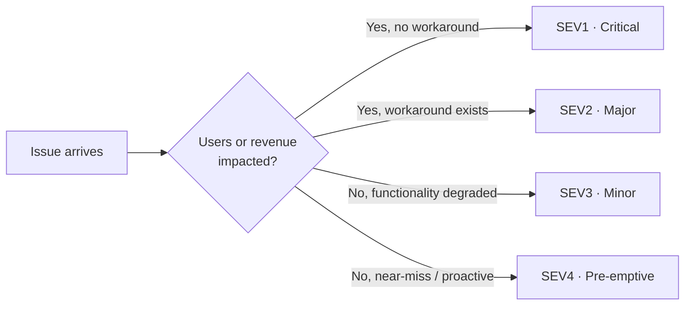

# Incidents

> When in doubt, declare. A false alarm costs minutes; a missed one costs hours.

How we think about incidents — the *what* and *why*. The under-pressure playbook lives in [runbooks/incident-response.md](../runbooks/incident-response.md); the RCA template at [incidents/TEMPLATE.md](../incidents/TEMPLATE.md); the protocol is ratified in [ADR 0040](../adr/0040-incident-management.md).

## What is and isn't an incident

**Always an incident:**

- Service unavailable or returning errors for users
- Data loss or suspected data loss
- A security event (exposed credentials, unauthorised access, suspicious activity)
- Any alert you're unsure about — declare first, downgrade later

**Not an incident:**

- A bug with a known workaround and no users blocked → normal ticket
- Scheduled maintenance → announced separately
- Slow performance within agreed SLO bounds → tune the dashboard, not the pager

Declaring an incident **does not** trigger external notifications. It opens a channel, assigns a lead, and starts the clock.

## Severity levels

Four levels. Customer/business impact, not engineering effort.

### SEV1 — Critical

Service down, data loss, or security breach. No workaround. Revenue or all users impacted.

- **Sprint impact:** stop sprint; all hands.
- **Response:** declare in the incident channel; on-call paged; incident lead assigned within 5 min.
- **Comms:** update every 15–30 min until resolved.
- **RCA:** required — team call within 24h of resolution.
- **Examples:** API returning 5xx for all requests · payments down · credentials exposed in logs · database unreachable.

### SEV2 — Major

Core flow degraded. Workaround exists. Subset of users affected.

- **Sprint impact:** interrupt the responsible owner; rest of team continues sprint.
- **Response:** owner picks up immediately; escalates to on-call if no resolution in 30 min.
- **Comms:** update at declaration, when materially new info appears, and at resolution.
- **RCA:** required — async write-up within 5 business days.
- **Examples:** search broken but browse works · elevated error rate on one endpoint · login slow · one region degraded.

### SEV3 — Minor

Non-critical bug or degradation. Users can work around it. No one blocked.

- **Sprint impact:** do not interrupt sprint; triage at next standup.
- **Response:** ticket created, triaged within one business day. **Auto-escalates to SEV2 after 2h of active investigation if no viable workaround surfaces** — a SEV3 you can't make a workaround for isn't really a SEV3.
- **Comms:** none unless it escalates.
- **RCA:** required on the 2nd occurrence within 30 days; optional otherwise (encouraged for anything worth learning from).
- **Examples:** non-critical feature broken with workaround · minor perf degradation · UI issue on a subset of browsers.

### SEV4 — Pre-emptive

Nothing broken yet. Near-miss, approaching resource limits, cosmetic, or tech-debt risk.

- **Sprint impact:** backlog; weekly triage.
- **Response:** no paging; owner assigned in next planning cycle.
- **Comms:** none.
- **RCA:** none.
- **Examples:** disk at 80% · SSL cert expiring in 14 days · dependency with known CVE (no active exploit) · UI misalignment.

## Severity ≠ Priority

Severity describes customer/business impact. Priority describes fix order. A SEV2 from your largest customer may be prioritised above a SEV1 at 03:00 that's auto-recovering. Severity gives you the framework; priority is judgement applied to that framework.

## Blameless culture

Post-mortems exist to improve systems, not to assign blame.

- An RCA that names an individual as the root cause has been written wrong. The cause is the system that let one person's mistake reach production — the missing guardrail, the gap in review, the ambiguous error path.
- "Operator error" is never a root cause. Every "operator error" is a system that demanded perfect operation under pressure.
- "What went poorly" is about decisions and conditions, not people. *"We rolled back at 14:30 instead of 14:10 because the runbook didn't exist"* is a system finding. *"Alice rolled back late"* is not.
- Reviewers reject blame-shaped post-mortems and ask for a rewrite.

This isn't soft. It's the only way the next incident learns from this one. People who fear blame hide context; the next responder works without it. (See [Google SRE — postmortem culture](https://sre.google/sre-book/postmortem-culture/).)

## Out-of-hours

OOH response is **defined per fork** — this template makes no claim about 24/7 reachability. If your fork has paid on-call (incident.io, PagerDuty, Opsgenie) or an explicit informal arrangement, wire it into the [runbook's escalation step](../runbooks/incident-response.md#escalation) and update the affected services' [CODEOWNERS](../adr/0031-github-repo-conventions.md#codeowners-githubcodeowners) `# alerting:` field.

## Where to go next

- Declaring an incident: post in the incident channel using the [message template in the runbook](../runbooks/incident-response.md#steps). Declaration is channel-first; no GitHub Issue or vendor tool required.
- The under-pressure playbook (declare → assess → resolve): [runbooks/incident-response.md](../runbooks/incident-response.md).
- The RCA template: [incidents/TEMPLATE.md](../incidents/TEMPLATE.md).
- Past RCAs to read for context: [docs/incidents/](../incidents/).
