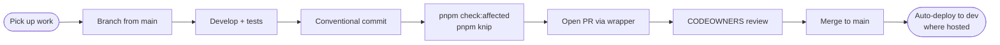

# Dev PR flow

## Overview

End-to-end procedure for landing a change: from picking up work
through PR-merged. Synthesises [ADR 0031](../adr/0031-github-repo-conventions.md)
(commits + CODEOWNERS review routing), [ADR 0037](../adr/0037-multi-agent-rule-distribution.md)
(definition of done), and [ADR 0035](../adr/0035-branching-releases-environments.md)
(branching). For the release procedure that follows merge to
`main`, see [release-pr-flow.md](release-pr-flow.md).

## Prerequisites

- Repo cloned; `pnpm install` run.
- `gh` CLI authenticated (`gh auth status`).
- `bd` installed if using local task capture
  ([CLAUDE.md → Task tracking](../../CLAUDE.md#task-tracking--local-vs-team)).
- Working directory is the repo root (
  [CLAUDE.md → Work from the repo root](../../CLAUDE.md#work-from-the-repo-root)).

## Steps



1. **Pick up the work.** Local capture via `bd q "<task>"` then
   `bd list --ready`; or grab a GitHub issue. Note the ticket
   reference (`#NNN` or `PROJ-NNN`) — every commit and the PR
   will need it.

2. **Branch from `main`.**

   ```bash
   git checkout main && git pull
   git checkout -b <type>/<ticket>-<short-desc>
   ```

   `<type>` is a Conventional Commits type (`feat`, `fix`,
   `chore`, etc.); `<short-desc>` is kebab-case, ≤ 5 words.
   Example: `feat/proj-42-search-endpoint`.

3. **Develop.** Run the relevant dev loop (`pnpm dev`, or
   filtered: `pnpm --filter @apps/<service> dev`). Write tests
   alongside the change.

4. **Commit conventionally.** `pnpm commit` walks the prompt, or
   write directly:

   ```
   <type>(<scope>): <subject> #<ticket>
   ```

   Scope is the NX project name. Ticket suffix is **required** —
   the pre-commit hook blocks commits without one
   ([ADR 0031 → Commit conventions](../adr/0031-github-repo-conventions.md#commit-conventions)).

5. **Before claiming done.** Run the Definition of Done:

   ```bash
   pnpm check:affected   # lint + typecheck + test on changed projects
   pnpm knip             # no new dead code
   ```

   Both must pass green. Fix don't skip
   ([CLAUDE.md → Fail, don't skip](../../CLAUDE.md#fail-dont-skip)).

6. **Open the PR.** Use the wrapper — direct `gh pr create` is
   blocked by hook:

   ```bash
   ./.claude/commands/create-pr.sh "<title>" "<summary>" <ticket>
   ```

   The wrapper appends the ticket to the title and writes
   `Closes #N` / `Refs PROJ-N` into the body.

7. **Review.** CODEOWNERS routes reviewers automatically
   ([ADR 0031 → CODEOWNERS](../adr/0031-github-repo-conventions.md#codeowners-githubcodeowners)). Address
   feedback by pushing follow-up commits to the branch (don't
   force-push unless rebasing is necessary).

8. **Merge.** When approved and CI is green, merge into `main`.
   Merge commit, squash, or rebase — author's choice for PR
   merges. Auto-delete branch on merge is on.

9. **After merge.** `main` auto-deploys to hosted dev if the
   service has one; otherwise verify locally. The change now
   sits on `main` waiting for the next release cut — see
   [release-pr-flow.md](release-pr-flow.md).

## Related

- [ADR 0031](../adr/0031-github-repo-conventions.md) — commit format
  + CODEOWNERS routing and team metadata; underpins auto-bump and review.
- [ADR 0037](../adr/0037-multi-agent-rule-distribution.md) —
  agent context, definition of done.
- [ADR 0035](../adr/0035-branching-releases-environments.md) —
  branching model and release flow this PR feeds into.
- [release-pr-flow.md](release-pr-flow.md) — what happens after
  the PR lands on `main`.
- [CLAUDE.md](../../CLAUDE.md) — operating rules, hooks, fail-don't-skip.
- [`./.claude/commands/create-pr.sh`](../../.claude/commands/create-pr.sh)
  — the PR creation wrapper.
