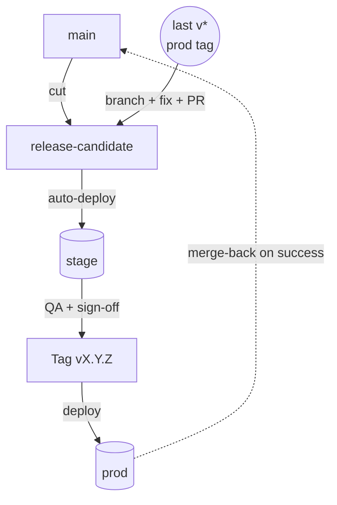

# Release PR flow

## Overview

Procedure for cutting a release: from "change is on `main`"
through "deployed to prod" and the automatic merge-back. Realises
[ADR 0024](../adr/0024-branching-releases-environments.md). For
the preceding step (getting a change onto `main`), see
[dev-pr-flow.md](dev-pr-flow.md).

Covers two paths:

- **Standard release** — most cuts; candidate originates from `main`.
- **Hotfix** — candidate originates from the production tag.



Standard path: top arrow (`main → release-candidate` cut). Hotfix
path: left arrow (`tag → branch → PR into release-candidate`).
Both converge at QA on stage and follow the same tag/deploy/merge-back
from there.

## Prerequisites

- Permission to dispatch the release workflows in the service's
  repo / project.
- Bot/automation actor with bypass-actor entitlement on `main`
  and `release-candidate` (workflows push to protected branches).
- `release-candidate` HEAD == last `v*` tag, i.e. no release in
  flight. The cut workflow enforces this; if violated, finish the
  current release first.

## Steps — standard release

1. **Decide to cut.** The trigger is human judgement: the work
   on `main` since the last tag is what you want to ship. Eyeball
   the diff: `git log <last-tag>..main`.

2. **Cut.** Dispatch the cut workflow (example name
   `cut-release.yml`) from the Actions UI. It merges `main` into
   `release-candidate` and pushes. Stage env auto-deploys from
   the new `release-candidate` HEAD.

   On merge conflict (rare; happens when `release-candidate` has
   commits not on `main`, typically prior hotfixes mid-merge-back),
   the workflow opens a PR for manual resolution. Resolve and
   merge that PR before continuing.

3. **QA on stage.** Verify the changes against the stage env.
   The release scope for changelog / review purposes is
   `git log <last-tag>..release-candidate`.

4. **Fix issues found in QA.** Two paths:
   - Small/safe: commit directly to `release-candidate`.
   - Larger/risky: PR into `release-candidate` from a short-lived
     branch.

   Each push redeploys to stage. Sign-off is human — the SOP
   doesn't dictate when.

5. **Tag.** Once signed off, dispatch the tag workflow (example
   `tag-release.yml`) targeting `release-candidate`. It:
   - Bumps the version in the relevant `package.json`.
   - Commits the bump on `release-candidate`.
   - Creates `vX.Y.Z` and pushes the tag.

   Bump type is auto-detected from Conventional Commits since the
   last tag ([ADR 0019](../adr/0019-conventional-commits.md)).
   Verify the bump matches expectation; a `feat:` slipped in as
   `chore:` produces a patch when you wanted a minor.

6. **Deploy prod.** Dispatch the deploy workflow (example
   `deploy-prod.yml`) with the new tag as input. It validates the
   tag, builds at the tag SHA, rolls out, and on full success
   merges the tag commit back to `main`.

   **A second human approves** the production environment step
   before regional rollout begins (GitHub Actions Environment
   protection — [ADR 0024](../adr/0024-branching-releases-environments.md)).

7. **Watch the rollout.** Monitor dashboards, alerts, and the
   service's runbooks for the deploy phase. If something breaks
   *before* the merge-back, fix forward — `main` is untouched.

8. **Merge-back is automatic on success.** Confirm `main` now
   contains the tag commit. Failed deploys leave `main` clean;
   investigate and fix forward (a hotfix, or another standard
   cut once `main` has the fix).

## Steps — hotfix

Same shape from step 5 onward; differs in steps 1–4.

1. **Branch from the tag.**

   ```bash
   git fetch --tags
   git checkout -b hotfix/<ticket>-<short-desc> v<last-prod-tag>
   ```

2. **Apply the fix.** Conventional `fix:` commits with ticket
   suffix. Tests for the fix are mandatory — the QA window on
   stage is shorter than a normal release.

3. **PR into `release-candidate`.** The PR is the gate. If a
   regular release is mid-flight on `release-candidate`, the
   conflict surfaces here for explicit resolution. **Do not
   force-reset `release-candidate` to the tag** — it silently
   destroys in-flight work.

4. **Merge the PR.** `release-candidate` auto-deploys to stage;
   verify the fix.

5–8. **Tag, deploy, watch, merge-back** — identical to the
standard flow above. The auto-bump should select PATCH for a
typical `fix:` commit; verify.

## When something goes wrong

| What | Where to look |
|---|---|
| Cut workflow fails precondition | `release-candidate` HEAD ≠ last tag — a release is in flight; finish it first. |
| Cut hits merge conflict | Workflow opens a PR — resolve and merge before continuing. |
| Tag workflow picks the wrong bump | Inspect the commit log since last tag; the wrong type was used somewhere. |
| Prod deploy fails partway | `main` untouched. Fix forward via hotfix flow against the latest tag, *not* by pushing to `main`. |
| Merge-back hits conflict | Workflow opens a PR — resolve manually. The release has already shipped to prod. |

## Related

- [ADR 0024](../adr/0024-branching-releases-environments.md) —
  the decisions this SOP realises.
- [ADR 0019](../adr/0019-conventional-commits.md) — commit format
  drives auto-bump.
- [ADR 0027](../adr/0027-codeowners-team-metadata.md) — CODEOWNERS
  metadata; the Escalation contacts during a deploy incident.
- [dev-pr-flow.md](dev-pr-flow.md) — the preceding flow that puts
  changes onto `main`.
- Service-specific runbooks live under `apps/<product>/<service>/runbooks/`
  per [ADR 0026](../adr/0026-runbook-and-sop-format.md) — check
  there for service-level operational context during a deploy.
